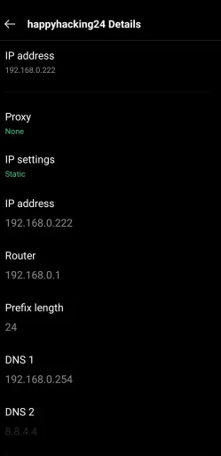
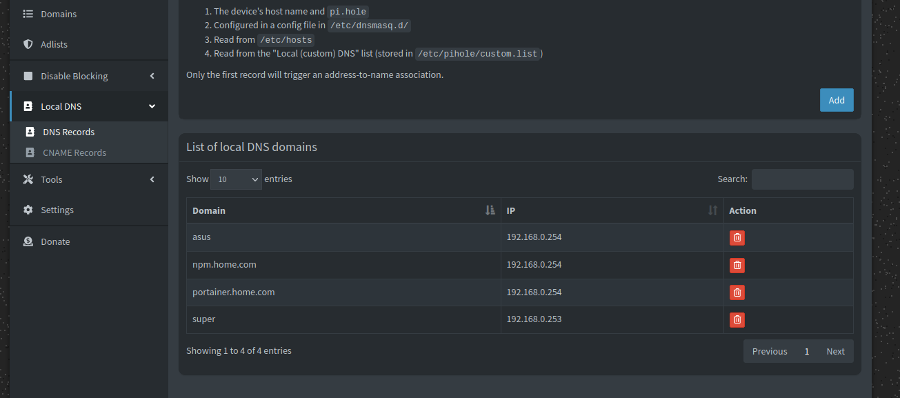
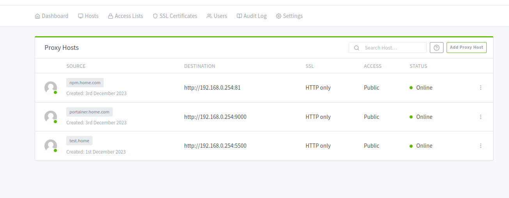

# pihole を使用するための設定

[公式 boilerplate](https://nginxproxymanager.com/setup/#using-mysql-mariadb-database)

```sh
docker compose up -d
```

### static IP の設定

下記で各種クライアントに Static IP を使って、DNS を指定する。
pi-hole が動いているサーバーにも Static IP を設定
今回は, **pihole が設定してあるサーバーを含め、DHCP を使わずに、すべて Static IP を設定**

またルーターに DNS を設定できるのであれば、ルーターで設定すれば一発でできる。

下記の設定では、DNS に他の 8.8.8.8 等を渡してないので、ネットワークエラーが出たらここを確認
(本来, ローカル DNS が動作しなくなった場合を想定して、8.8.8.8 等を渡しておくべき。
ローカル DNS だけで試せば、うまく動作していない場合にエラーがでるので、確認しやすい)

- IP adress の確認

linux

```sh
ifconfig # linux
# or
ip addr | grep wl | grep -oP 'inet \K[\d.]+' # linux
# or
ssh -q -o LogLevel=error ＜ホスト名＞ \
  <<EOF
ip addr | grep wl | grep -oP 'inet \K[\d.]+'
EOF
```

windows

```
ipconfig
```

- wifi を使った際の ubuntu の場合の設定

`sudo vim /etc/netplan/01-network-maanger-all.yaml`

```sh
network:
  version: 2
  renderer: NetworkManager
  wifis:
    wlp2s0: # ネットワークインターフェース名 ifconfigで調べる

      dhcp4: false
      optional: false
      addresses:
        - 192.168.0.254/24
      routes:
        - to: default
          via: 192.168.0.1
      nameservers:
        addresses: [192.168.0.254] # docker pi-hole 使ってるIPアドレス
      access-points:
        "happyhacking24":
          password: "<パスワード>"
```

netplan の確認 (ubuntu のみ)

```sh
sudo grep -v '^#\|^$' -R /etc/netplan*
nmcli | grep DNS -A 3
```

- スマホの設定

wifi の設定から変更できる。



- windows

TODO
(持ってないのでわかりません。)

#### Ubuntu port 53 問題 (Ubuntu のみ)

ubuntu ではデフォルトで port 53 を使っているので、
使用しているプロセスを終了させる必要がある。

```sh
sudo netstat -tulpn | grep LISTEN | grep 53
sudo vim /etc/systemd/resolved.conf
```

uncomment `DNSStubListener=no`

```sh
sudo systemctl restart systemd-resolved
sudo systemctl status systemd-resolved
```

### local DNS

pi-hole が DNS として動作して、nginx proxy manager が proxy として動作。

pi-hole に設定したレコードに合わせる



.com で終わっているものは、docker で動いているローカルのページ (下記の pihole に合わせて設定)
それ以外はデバイスのアドレスにするので ssh や ping に Domain 名が使える
`ping asus`



source は、pi hole の local DNS に設定しているように合わせる。
例えば、この設定では portainer にブラウザで`portainer.home.com`と入力すればアクセスできるようになる

### 接続確認

```sh
nslookup portainer.home.com # ちゃんとIP addressが返ってくること
host <IP アドレス>
```

結果

```
Server:         192.168.0.254
Address:        192.168.0.254#53

Name:   portainer.home.com
Address: 192.168.0.254
```

DNS を pi-hole のみにした場合にネットワーク接続ができること
