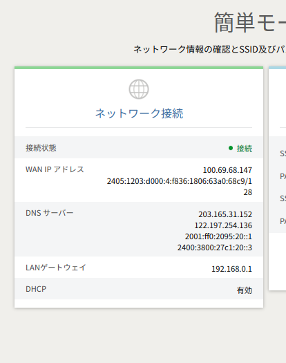

### 自宅 wifi の設定

特に設定してない場合は、ブラウザで`192.168.0.1`と入力すれば管理画面にいけるはず。
パスワードはモデムの後ろを確認

### ip address の固定

[freecodecamp](https://www.freecodecamp.org/news/setting-a-static-ip-in-ubuntu-linux-ip-address-tutorial/)

[Ubuntu static IP address](../containers/nginx-proxy-manager/README.md)

windows は全くわからんけど、GUI でできて、超簡単なはず。

### DNS 設定

機種によって、DNS を設定できるものとできないものがあるらしい。
ルーターで設定できない場合は個別にスマホや PC のクライアント側で設定する必要がある。
(簡単かつ一回設定すれば、大丈夫)

[クライアントごとに DNS を個別に設定する](../containers/nginx-proxy-manager/README.md)



### 初期設定のパスワードを変更 (おまけ)

- モデム自体のログインパスワードを設定

```sh
openssl rand -base64 128
```

では禁止文字が含まれる可能性があるため

```sh
function generate_random_string_for_wifi() {
    cat /dev/urandom |
        tr -dc '!%&*+,-.^_~A-Za-z0-9' | fold -w ${1} |
        grep -e '^[a-z]' -e '^[A-Z]' -e '^[0-9]' |
        grep '[#?_!]' | grep '[A-Z]' | grep '[a-z]' | grep '[0-9]' |
        grep -vE '(.)\1' |
        head -n 1
}

generate_random_string_for_wifi "${@}"
```

とかで指定文字列の中からランダムに生成されたパスワードを設定
ちゃんと一行かとか余分なスペースがないかは要確認

### 再起動

だいたい電源抜いて、10 秒待って指し直せばいいだけ。
念の為、公式確認
